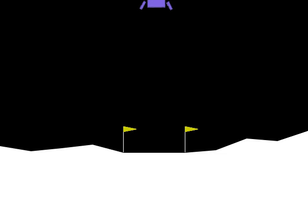

# GNN and PPO-based Lunar Landing

## Model Performance video

## Overview
This project explores different deep reinforcement learning architectures for solving the Lunar Lander problem. The primary focus is on comparing:

- **MLP Policy with PPO**
- **GNN POlicy with PPO**
- **Transformer with PPO**

The objective is to evaluate how different model architectures affect training performance and the ability to land the spacecraft successfully.

## Methodology

### Proximal Policy Optimization (PPO)
PPO is a policy gradient method that improves sample efficiency while maintaining stable updates. It has been widely used in reinforcement learning problems, including control tasks like Lunar Lander.

### Architectures Tested

1. **MLP with PPO**: A standard multi-layer perceptron (MLP) was used as the policy network for PPO. This is a baseline approach commonly used in reinforcement learning.
2. **GNN with PPO**: A Graph Neural Network (GNN) was integrated with PPO to capture spatial and structural relationships in the environment.
3. **Transformer with PPO**: A transformer-based policy was tested, but it did not yield satisfactory results.

## Results & Observations

### Training Performance
Two main graphs illustrate the training progress of the models:

- **PPO with MLP:** The reward curve exhibits a gradual upward trend but with noticeable fluctuations and occasional instability. This reflects the MLP’s limited capacity to capture complex feature dependencies in the Lunar Lander state.

- **GNN with PPO:** The GNN-based policy converges more smoothly, with mean rewards stabilizing closer to the environment’s target score (200). The success-rate plot shows that the GNN approach achieves successful landings more consistently than the MLP-based agent, indicating better robustness and generalization.

### Key Findings
- The **GNN-based PPO** outperforms the **MLP-based PPO** in terms of stability and success rate.
- The **Transformer-based PPO** struggled and did not show promising results.
- The **GNN approach led to higher mean rewards and a better success rate**, making it the preferred architecture for the task.

## Conclusion
Using GNNs with PPO provides a more robust approach to solving the Lunar Lander problem compared to MLP-based PPO. Future work could explore hyperparameter tuning and modifications to the transformer-based approach to improve its performance.
